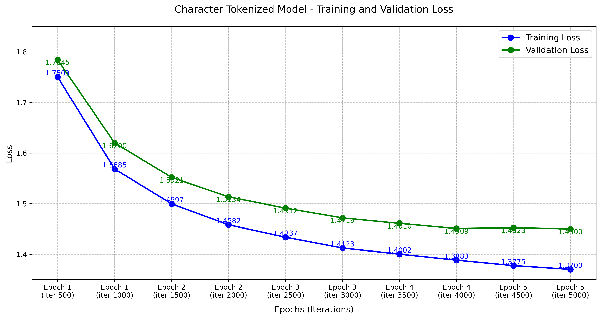

# GPT-2 from Scratch

A character-level GPT-2 implementation trained on poetry dataset.

## Dataset

- Scraped **11,000+ poems** from approximately **800 authors**
- Data collected from mypoeticside.com using custom scraping scripts
- Comprehensive collection of various poetic styles and themes

## Model Architecture 

The model is implemented as a character-level transformer with the following specifications:

| Parameter | Value |
|-----------|--------|
| Total Parameters | 21.77M |
| Tokenization | Character-level |
| Vocabulary Size | 202 |
| Device | CUDA |

## Configuration

| Parameter | Value |
|-----------|--------|
| Learning Rate | 0.0006 |
| Batch Size | 64 |
| Block Size | 256 |
| Max Iterations | 5,000 |
| Evaluation Interval | 500 |
| Evaluation Iterations | 200 |
| Number of Epochs | 5 |
| Dropout | 0.1 |
| Number of Heads | 12 |
| Number of Layers | 12 |
| Embedding Dimension | 768 |

## Training Progress

The following graph shows the training and validation loss over time:

## Model Components

- Token Embedding Table
- Position Embedding Table
- Multi-Head Self Attention with 12 heads
- Feed Forward Network
- Layer Normalization
- Linear Output Layer (LM Head)

## Training Infrastructure

The model was trained using CUDA-enabled GPU infrastructure for optimal performance.