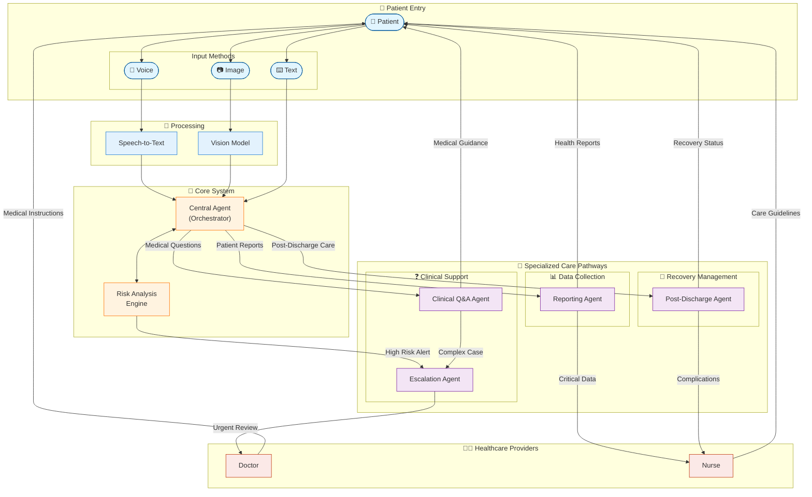

```mermaid
flowchart TB
    subgraph Patient ["🏥 Patient Entry"]
        User(["👤 Patient"])
        
        subgraph Inputs ["Input Methods"]
            Voice(["🎤 Voice"])
            Text(["⌨️ Text"])
            Image(["📷 Image"])
        end
    end

    subgraph Processing ["🔄 Processing"]
        STT["Speech-to-Text"]
        VLLM["Vision Model"]
    end

    subgraph Core ["🧠 Core System"]
        Central["Central Agent<br>(Orchestrator)"]
        RiskEngine["Risk Analysis<br>Engine"]
    end

    subgraph AgentRouting ["🤖 Specialized Care Pathways"]
        direction TB
        
        subgraph DataReporting ["📊 Data Collection"]
            Report["Reporting Agent"]
        end
        
        subgraph ClinicalCare ["❓ Clinical Support"]
            Clinical["Clinical Q&A Agent"]
            Escalation["Escalation Agent"]
        end
        
        subgraph Recovery ["🏥 Recovery Management"]
            Discharge["Post-Discharge Agent"]
        end
    end

    subgraph Medical ["👨‍⚕️ Healthcare Providers"]
        Doctor["Doctor"]
        Nurse["Nurse"]
    end

    %% Input flows
    User --> Voice & Text & Image
    Voice --> STT
    Image --> VLLM
    STT & VLLM & Text --> Central

    %% Core system interaction
    Central <--> RiskEngine

    %% Clean routing paths to specialized agents
    Central --> |"Patient Reports"| Report
    Central --> |"Medical Questions"| Clinical
    Central --> |"Post-Discharge Care"| Discharge
    
    %% Risk-based routing
    RiskEngine --> |"High Risk Alert"| Escalation
    Clinical --> |"Complex Case"| Escalation
    
    %% Healthcare provider involvement
    Report --> |"Critical Data"| Nurse
    Escalation --> |"Urgent Review"| Doctor
    Discharge --> |"Complications"| Nurse

    %% Return paths to patient
    Report --> |"Health Reports"| User
    Clinical --> |"Medical Guidance"| User
    Discharge --> |"Recovery Status"| User
    Doctor --> |"Medical Instructions"| User
    Nurse --> |"Care Guidelines"| User

    %% Styling
    classDef patient fill:#e1f5fe,stroke:#01579b
    classDef processing fill:#e3f2fd,stroke:#1976d2
    classDef core fill:#fff3e0,stroke:#ff6f00
    classDef agents fill:#f3e5f5,stroke:#7b1fa2
    classDef medical fill:#fbe9e7,stroke:#bf360c

    class User,Voice,Text,Image patient
    class STT,VLLM processing
    class Central,RiskEngine core
    class Report,Clinical,Discharge,Escalation agents
    class Doctor,Nurse medical
```